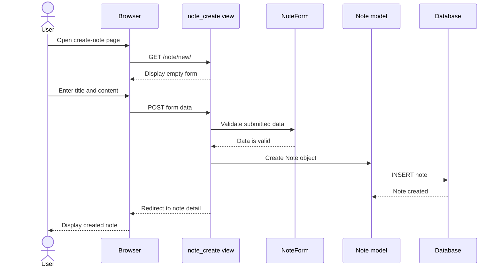
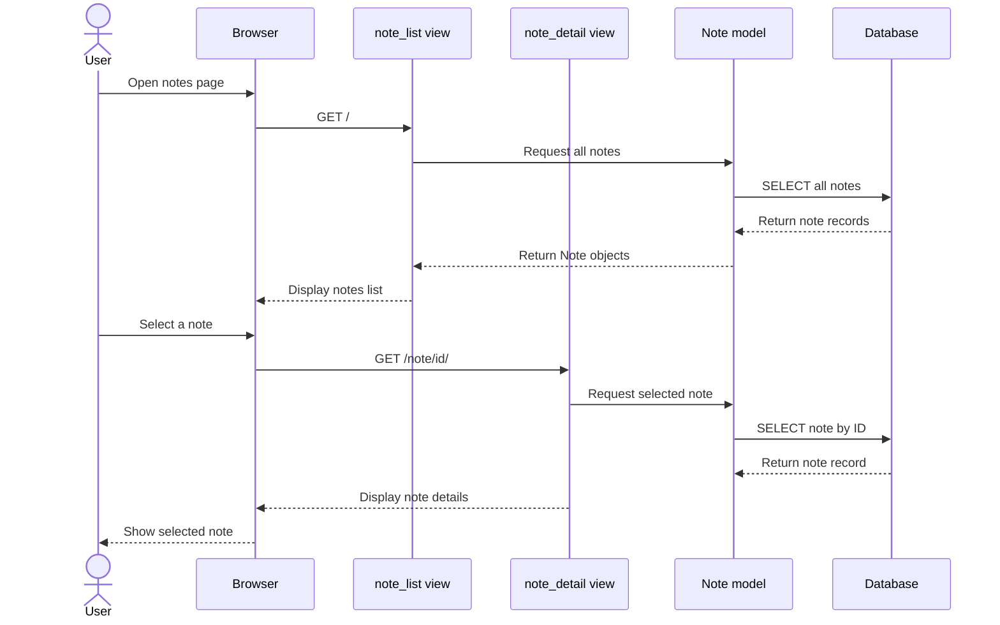
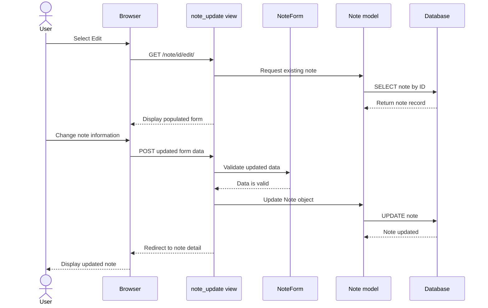
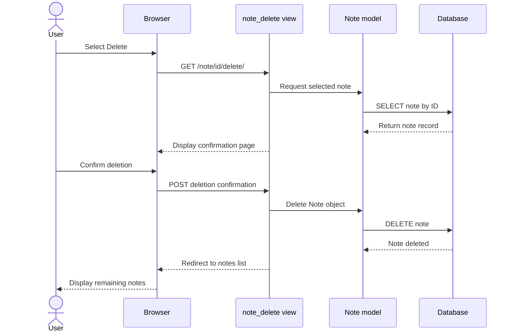

# Sticky Notes CRUD Sequence Diagrams

## Create a note

```mermaid
sequenceDiagram
    actor User
    participant Browser
    participant CreateView as note_create view
    participant Form as NoteForm
    participant Model as Note model
    participant Database

    User->>Browser: Open create-note page
    Browser->>CreateView: GET /note/new/
    CreateView-->>Browser: Display empty form

    User->>Browser: Enter title and content
    Browser->>CreateView: POST form data
    CreateView->>Form: Validate submitted data
    Form-->>CreateView: Data is valid
    CreateView->>Model: Create Note object
    Model->>Database: INSERT note
    Database-->>Model: Note created
    CreateView-->>Browser: Redirect to note detail
    Browser-->>User: Display created note
```

## Read notes

```mermaid
sequenceDiagram
    actor User
    participant Browser
    participant ListView as note_list view
    participant DetailView as note_detail view
    participant Model as Note model
    participant Database

    User->>Browser: Open notes page
    Browser->>ListView: GET /
    ListView->>Model: Request all notes
    Model->>Database: SELECT all notes
    Database-->>Model: Return note records
    Model-->>ListView: Return Note objects
    ListView-->>Browser: Display notes list

    User->>Browser: Select a note
    Browser->>DetailView: GET /note/id/
    DetailView->>Model: Request selected note
    Model->>Database: SELECT note by ID
    Database-->>Model: Return note record
    DetailView-->>Browser: Display note details
    Browser-->>User: Show selected note
```

## Update a note

```mermaid
sequenceDiagram
    actor User
    participant Browser
    participant UpdateView as note_update view
    participant Form as NoteForm
    participant Model as Note model
    participant Database

    User->>Browser: Select Edit
    Browser->>UpdateView: GET /note/id/edit/
    UpdateView->>Model: Request existing note
    Model->>Database: SELECT note by ID
    Database-->>Model: Return note record
    UpdateView-->>Browser: Display populated form

    User->>Browser: Change note information
    Browser->>UpdateView: POST updated form data
    UpdateView->>Form: Validate updated data
    Form-->>UpdateView: Data is valid
    UpdateView->>Model: Update Note object
    Model->>Database: UPDATE note
    Database-->>Model: Note updated
    UpdateView-->>Browser: Redirect to note detail
    Browser-->>User: Display updated note
```

## Delete a note

```mermaid
sequenceDiagram
    actor User
    participant Browser
    participant DeleteView as note_delete view
    participant Model as Note model
    participant Database

    User->>Browser: Select Delete
    Browser->>DeleteView: GET /note/id/delete/
    DeleteView->>Model: Request selected note
    Model->>Database: SELECT note by ID
    Database-->>Model: Return note record
    DeleteView-->>Browser: Display confirmation page

    User->>Browser: Confirm deletion
    Browser->>DeleteView: POST deletion confirmation
    DeleteView->>Model: Delete Note object
    Model->>Database: DELETE note
    Database-->>Model: Note deleted
    DeleteView-->>Browser: Redirect to notes list
    Browser-->>User: Display remaining notes
```